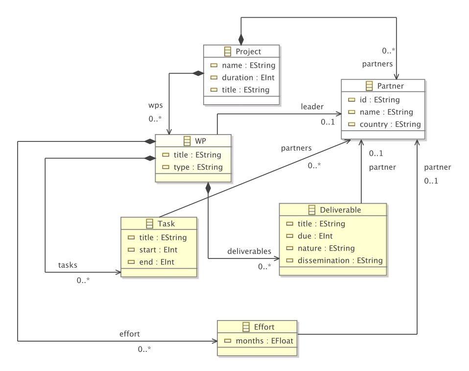
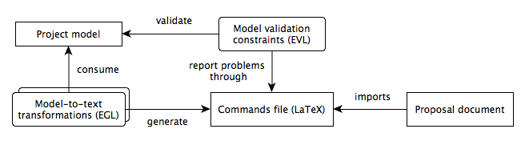

Designing a collaborative reserach project is a complex task that involves splitting the work across a number of work-packages, breaking work-packages down into tasks and deliverables, allocating effort to different partners etc. Moreover, to comply with the requirements of the funder, proposal documents need to contain several tables with overlapping information (effort per work-package, effort per partner, deliverables per work-package, deliverables for the entire project in chronological order etc.). Maintaining these tables manually is very error prone, particularly as the deadline approaches.

To ensure consistency, a model that conforms to the metamodel below can be constructed  

and then used to generate all these overlapping tables in a consistent manner. This use-case can also demonstrate the need for OCL-like model validation as models conforming to the metamodel above need to satisfy additional constraints that cannot be expressed by Ecore itself (e.g. the end-month of a task needs to be greater than its start month, the leader of a work-package needs to have some effort allocated in the work-package etc.). An overview of the workflow is provided below.

This use-case, along with an estimate of the benefits it has delivered in the context of several EC-funded projects is discussed in more detail in the paper ACM/IEEE MoDELS 2014 paper [Model-Driven Grant Proposal Engineering](http://link.springer.com/chapter/10.1007%2F978-3-319-11653-2_26).
